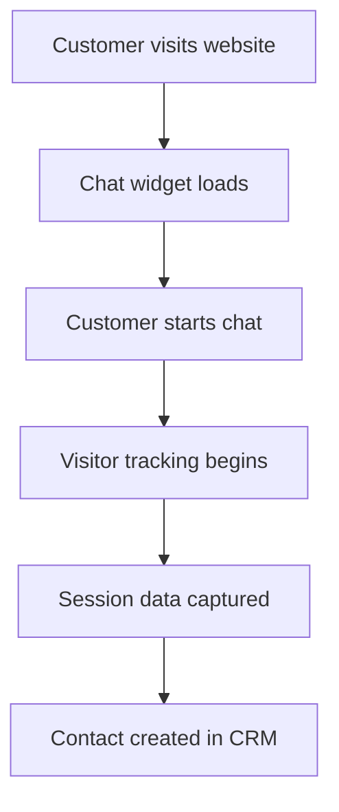
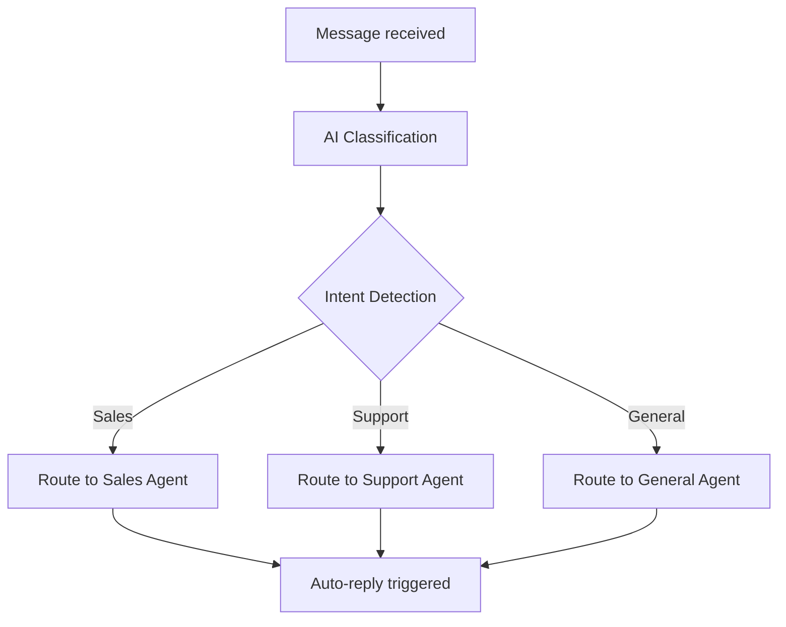
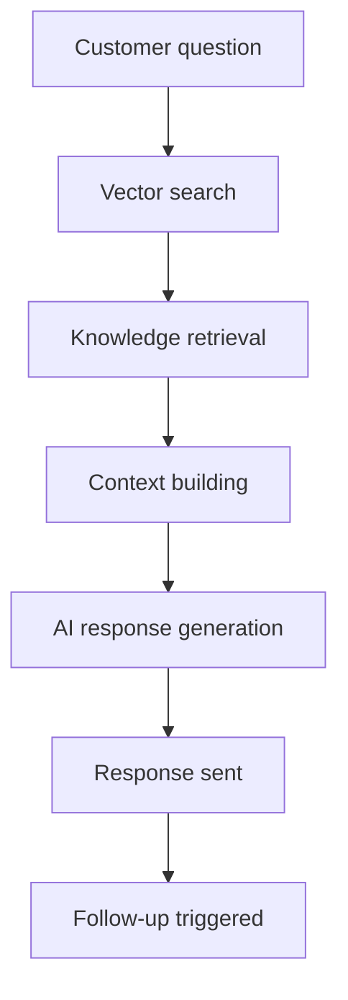
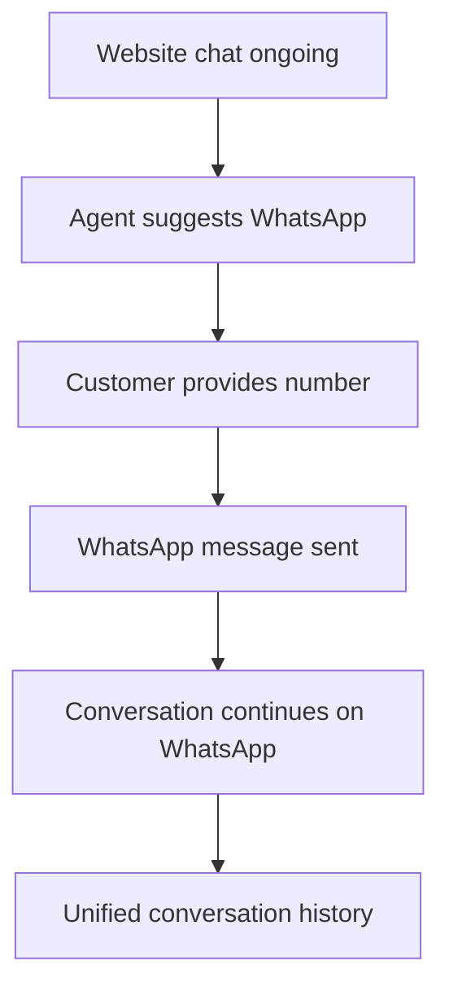
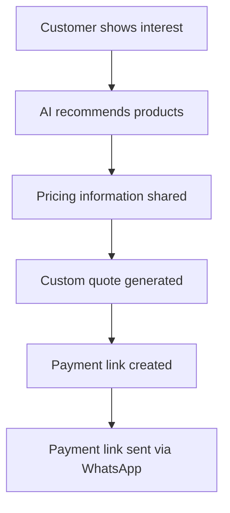
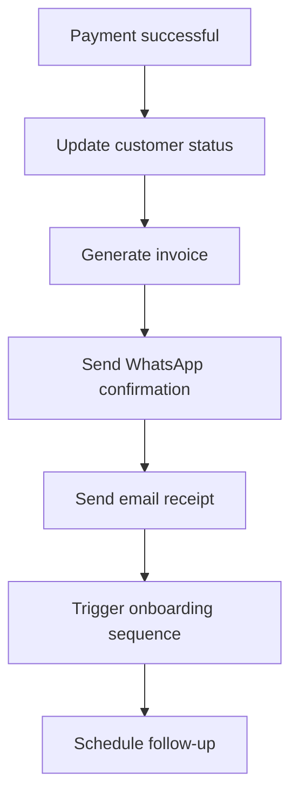
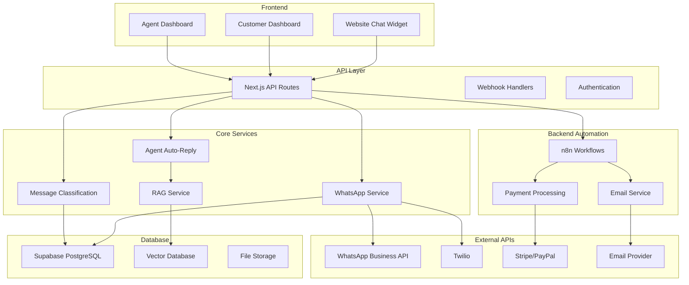

# 🔄 Complete Automation Flow Documentation

## 📋 **Overview: Website Traffic → Payment Finalization**

This document outlines the complete customer journey from website visit to payment completion, showing how automation and AI agents handle the entire process.

---

## 🌐 **Phase 1: Website Traffic Capture**

### **1.1 Website Chat Widget Integration**


**Components:**
- **Website Chat Widget** (`lib/providers/website-chat/`)
- **Session tracking** (visitor ID, page URL, user agent)
- **Real-time messaging** via WebSocket/SSE

**Data Captured:**
```typescript
{
  visitorId: "unique_visitor_id",
  sessionId: "chat_session_id",
  visitorEmail: "customer@email.com",
  visitorName: "John Doe",
  pageUrl: "https://website.com/products",
  pageTitle: "Product Page",
  userAgent: "browser_info",
  timestamp: "2024-01-01T10:00:00Z"
}
```

### **1.2 Contact & Conversation Creation**
```typescript
// Contact created in CRM
const contact = {
  platform: 'website-chat',
  platform_id: visitorId,
  email: visitorEmail,
  display_name: visitorName,
  lifecycle_stage: 'lead',
  acquisition_source: 'website_chat',
  metadata: {
    first_contact: timestamp,
    page_url: pageUrl,
    user_agent: userAgent
  }
};

// Conversation initiated
const conversation = {
  contact_id: contact.id,
  platform: 'website-chat',
  status: 'active',
  priority: 'medium',
  category: 'acquisition'
};
```

---

## 🤖 **Phase 2: AI Agent Automation**

### **2.1 Message Classification & Routing**


**AI Classification Process:**
```typescript
// Message classification using AI
const classification = {
  intent: 'sales_inquiry',
  category: 'acquisition',
  priority: 'high',
  sentiment: 'positive',
  urgency_score: 7,
  keywords_matched: ['price', 'buy', 'demo'],
  confidence: 0.89,
  escalation_recommended: false
};
```

### **2.2 Agent Assignment & Auto-Reply**
```typescript
// Agent assignment rules
const agentAssignment = {
  conversation_id: conversationId,
  agent_id: 'ai_sales_agent_001',
  agent_type: 'ai_agent',
  auto_response_enabled: true,
  assignment_reason: 'sales_inquiry_detected'
};

// Auto-reply generation
const autoReply = await ragService.generateResponse({
  agentId: 'ai_sales_agent_001',
  customerMessage: "What's the pricing?",
  conversationHistory: [...],
  customerInfo: contact
});
```

### **2.3 Knowledge Base Integration (RAG)**


**RAG Process:**
- **Vector search** in knowledge base
- **Context-aware** response generation
- **Conversation history** consideration
- **Customer profile** personalization

---

## 📱 **Phase 3: WhatsApp Integration**

### **3.1 Channel Transition**


### **3.2 WhatsApp Webhook Processing**
```typescript
// WhatsApp webhook flow
export async function POST(request: NextRequest) {
  const payload = await request.json();

  // Process Twilio or WhatsApp Business API
  if (payload.messaging) {
    // Twilio webhook
    for (const message of payload.messaging) {
      await whatsappService.processTwilioWebhook(message);
    }
  } else if (payload.entry) {
    // WhatsApp Business API
    for (const entry of payload.entry) {
      await whatsappService.processWhatsAppBusinessWebhook(entry);
    }
  }
}
```

### **3.3 Multi-Platform Message Sync**
```typescript
// Unified conversation across platforms
const messageSync = {
  conversation_id: "conv_123",
  platforms: ['website-chat', 'whatsapp'],
  unified_history: [
    { platform: 'website-chat', message: "Hi, interested in pricing" },
    { platform: 'whatsapp', message: "Thanks for the quick response!" }
  ]
};
```

---

## 💰 **Phase 4: Payment Integration**

### **4.1 Product/Service Recommendation**


### **4.2 Checkout Flow Integration**
```typescript
// Checkout flow trigger
const checkoutFlow = {
  customer_id: contact.id,
  conversation_id: conversationId,
  products: [
    {
      name: "Premium Package",
      price: 9999,
      currency: "INR",
      duration: "monthly"
    }
  ],
  payment_methods: ['upi', 'credit_card', 'debit_card'],
  custom_message: "Complete your purchase to get started!"
};

// Payment link generation
const paymentLink = await generatePaymentLink({
  amount: 9999,
  currency: 'INR',
  customer_email: contact.email,
  customer_phone: contact.phone,
  success_url: '/payment/success',
  cancel_url: '/payment/cancel'
});
```

### **4.3 Payment Processing**
```typescript
// Payment webhook handling
export async function POST(request: NextRequest) {
  const payload = await request.json();

  if (payload.event_type === 'payment.success') {
    // Update customer lifecycle
    await updateCustomerStatus(payload.customer_id, 'customer');

    // Trigger onboarding workflow
    await triggerOnboardingFlow(payload.customer_id);

    // Send confirmation via WhatsApp & Email
    await sendPaymentConfirmation(payload);
  }
}
```

---

## 📧 **Phase 5: Email & WhatsApp Finalization**

### **5.1 Payment Confirmation Flow**


### **5.2 Multi-Channel Confirmation**
```typescript
// WhatsApp confirmation
const whatsappConfirmation = {
  to: customer.phone,
  template: 'payment_success',
  variables: {
    customer_name: customer.name,
    amount: payment.amount,
    invoice_number: invoice.number,
    next_steps: "Your account is being set up..."
  }
};

// Email confirmation
const emailConfirmation = {
  to: customer.email,
  subject: 'Payment Confirmation - Welcome!',
  template: 'payment_success_email',
  attachments: [
    { filename: 'invoice.pdf', content: invoicePdf }
  ]
};
```

### **5.3 Automated Follow-up Sequence**
```typescript
// n8n workflow triggers
const followUpWorkflow = {
  workflow_name: 'post_payment_onboarding',
  trigger_data: {
    customer_id: customer.id,
    payment_amount: payment.amount,
    plan_type: 'premium'
  },
  schedule: [
    { delay: '1 hour', action: 'send_welcome_guide' },
    { delay: '1 day', action: 'check_account_setup' },
    { delay: '3 days', action: 'collect_feedback' },
    { delay: '7 days', action: 'upsell_additional_features' }
  ]
};
```

---

## 🔄 **Backend n8n Automation Workflows**

### **6.1 Customer Lifecycle Automation**
```yaml
Workflow: customer_onboarding
Trigger: Payment successful webhook
Steps:
  1. Update CRM status → 'customer'
  2. Create user account
  3. Send welcome email sequence
  4. Set up product access
  5. Schedule onboarding call
  6. Add to customer success automation
```

### **6.2 Follow-up & Retention**
```yaml
Workflow: customer_retention
Trigger: 30 days after purchase
Steps:
  1. Check product usage metrics
  2. Send satisfaction survey
  3. If low usage → trigger re-engagement
  4. If high usage → send upsell offer
  5. Schedule quarterly check-in
```

### **6.3 Support Escalation**
```yaml
Workflow: support_escalation
Trigger: AI agent requests escalation
Steps:
  1. Notify human support team
  2. Transfer conversation context
  3. Update customer priority
  4. Set SLA timers
  5. Monitor resolution time
```

---

## 🏗️ **Complete System Architecture**



---

## 📊 **Key Metrics & Analytics**

### **Conversion Tracking**
```typescript
const conversionMetrics = {
  website_visitors: 1000,
  chat_initiations: 150,      // 15% engagement rate
  lead_qualified: 75,         // 50% qualification rate
  demos_scheduled: 30,        // 40% demo conversion
  payments_completed: 12,     // 40% close rate
  overall_conversion: 1.2     // 1.2% website → payment
};
```

### **Automation Efficiency**
```typescript
const automationMetrics = {
  ai_response_rate: 85,       // 85% messages handled by AI
  average_response_time: 30,   // 30 seconds
  escalation_rate: 15,        // 15% require human intervention
  customer_satisfaction: 4.2, // 4.2/5 rating
  cost_per_conversion: 450    // ₹450 per paying customer
};
```

---

## 🚀 **Implementation Checklist**

### **Phase 1: Basic Setup**
- [x] Website chat widget integration
- [x] WhatsApp webhook handling
- [x] Basic message routing
- [x] Contact management

### **Phase 2: AI Enhancement**
- [x] Agent auto-reply system
- [x] Message classification
- [x] RAG knowledge base
- [x] Conversation routing

### **Phase 3: Payment Integration**
- [x] Checkout flow components
- [x] Payment link generation
- [x] Webhook processing
- [x] Confirmation automation

### **Phase 4: Advanced Automation**
- [x] n8n workflow integration
- [x] Multi-channel messaging
- [x] Customer lifecycle management
- [x] Analytics & reporting

---

## 💡 **Optimization Opportunities**

### **Immediate Improvements**
1. **A/B Testing**: Test different chat widget positions and messages
2. **Response Templates**: Create industry-specific response templates
3. **Sentiment Analysis**: Prioritize negative sentiment messages
4. **Predictive Routing**: Use ML to predict best agent assignment

### **Advanced Features**
1. **Voice Messages**: WhatsApp voice note support
2. **Video Calls**: Integration with Zoom/Meet for demos
3. **Document Sharing**: Automated proposal generation
4. **Chatbot Training**: Continuous learning from conversations

### **Performance Metrics**
1. **Response Time**: Target <30 seconds for AI responses
2. **Resolution Rate**: >80% issues resolved without escalation
3. **Conversion Rate**: >2% website visitors to paying customers
4. **Customer Satisfaction**: >4.5/5 rating

---

This automation flow creates a seamless customer journey from initial website interest to completed purchase, with AI handling most interactions while maintaining the option for human intervention when needed. The system is designed for scalability and can handle thousands of concurrent conversations across multiple channels.