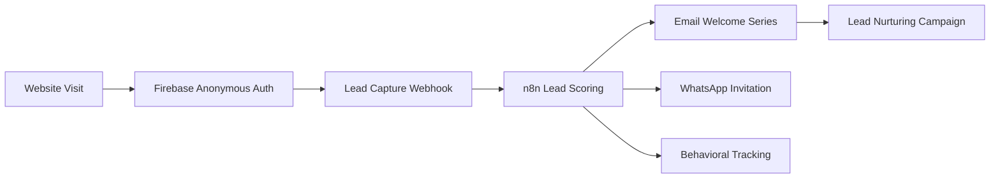
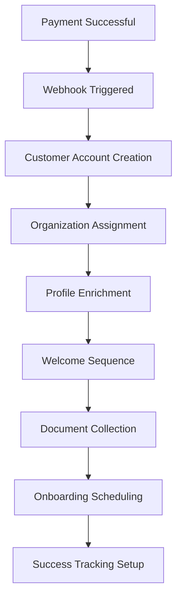
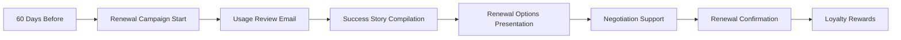

# 🎯 Customer Journey Automation & Workflow Implementation

## 🚀 Complete Customer Journey Map

### 📱 **Multi-Channel Customer Journey**
```
Website → WhatsApp → Payment → Onboarding → Success → Retention → Advocacy
   ↓         ↓          ↓          ↓         ↓         ↓         ↓
Firebase   n8n      Stripe    Automation  Analytics  Renewal   Referral
  Auth   Workflows  Payment   Sequences   Tracking   Flows     Programs
```

## 🎪 Stage-by-Stage Automation Flows

### 🎯 **Stage 1: Awareness & Lead Capture**

#### **Touchpoints:**
- 🌐 Website landing pages
- 💬 Chat widget interactions
- 📱 Social media ads
- 📧 Email campaigns

#### **Firebase Integration:**
```typescript
// Anonymous user tracking and conversion
Firebase Analytics → Custom Events → Lead Scoring → n8n Trigger
```

#### **n8n Automation Workflows:**


**Implementation:**
```typescript
// Webhook: /api/webhooks/lead-capture
{
  "firebase_uid": "anonymous_user_123",
  "source": "website_chat",
  "page_url": "/insurance-quotes",
  "utm_campaign": "google_ads_insurance",
  "behavior_data": {
    "time_on_page": 120,
    "scroll_depth": 0.75,
    "form_interactions": 2
  }
}

// n8n Response: Trigger 5 workflows
1. Lead Scoring Algorithm
2. Welcome Email Sequence (5 emails over 7 days)
3. WhatsApp Invitation with personalized message
4. Behavioral Analytics Setup
5. Sales Team Notification (for high-score leads)
```

---

### 💬 **Stage 2: Engagement & Qualification**

#### **Primary Channel: WhatsApp Business**

#### **Customer Actions:**
- 📱 Responds to WhatsApp invitation
- 💭 Asks questions about products
- 📋 Provides initial information
- 🔍 Requests quotes or demos

#### **n8n Automation Triggers:**
```typescript
// Every WhatsApp message triggers 11 comprehensive workflows
await whatsappService.triggerComprehensiveFinancialN8nWorkflows(
  conversationId, customer, messageContent
)
```

#### **Detailed Workflow Breakdown:**

##### **1. Advanced Lead Scoring** (`triggerFinancialLeadScoring`)
```typescript
Workflow Purpose: Real-time lead qualification
Triggers: Every customer message
Data Processed:
- Message sentiment analysis
- Financial intent detection
- Urgency level calculation
- Customer profile enrichment

Output Actions:
- Update lead score (1-100)
- Trigger sales alerts for hot leads (>80)
- Personalize response templates
- Schedule follow-up sequences
```

##### **2. Omnichannel Orchestration** (`triggerOmnichannelOrchestration`)
```typescript
Workflow Purpose: Coordinate customer experience across all channels
Triggers: Cross-channel interactions
Data Processed:
- Current channel preferences
- Historical interaction data
- Communication frequency preferences
- Language and timing preferences

Output Actions:
- Send personalized emails
- Schedule SMS reminders
- Update CRM with preferences
- Trigger push notifications
```

##### **3. Support Escalation** (`triggerSupportEscalation`)
```typescript
Workflow Purpose: Intelligent routing to human agents
Triggers: Complex queries, negative sentiment, high-value customers
Data Processed:
- Customer tier (basic/premium/enterprise)
- Issue complexity analysis
- Financial impact assessment
- Regulatory sensitivity check

Output Actions:
- Route to appropriate agent
- Create support ticket
- Notify management for VIP customers
- Trigger resolution SLA tracking
```

##### **4. Business Intelligence** (`triggerBIAnalytics`)
```typescript
Workflow Purpose: Real-time business metrics and insights
Triggers: All customer interactions
Data Processed:
- Customer lifetime value calculations
- Conversation analytics
- Product performance metrics
- Market trend analysis

Output Actions:
- Update executive dashboards
- Generate daily/weekly reports
- Trigger pricing adjustments
- Alert on anomalies
```

##### **5. Dynamic Pricing** (`triggerDynamicPricing`)
```typescript
Workflow Purpose: Real-time price optimization
Triggers: Pricing inquiries, quote requests
Data Processed:
- Customer risk profile
- Market conditions
- Competitor pricing
- Product demand metrics

Output Actions:
- Generate personalized quotes
- Apply dynamic discounts
- Update pricing models
- Track pricing effectiveness
```

---

### 💳 **Stage 3: Purchase & Payment**

#### **Payment Success Automation** (`/api/webhooks/payment-success`)



#### **Comprehensive Payment Automation:**
```typescript
// 12 simultaneous workflows triggered on payment success
1. Customer Account Provisioning
2. Welcome Email Sequence (immediate)
3. Document Collection Workflow
4. Onboarding Call Scheduling
5. Product Activation
6. Compliance Documentation
7. Success Metrics Setup
8. Referral Program Enrollment
9. Upsell Opportunity Analysis
10. Customer Success Assignment
11. Analytics Event Tracking
12. CRM Integration Sync
```

#### **Implementation Flow:**
```typescript
PaymentSuccess → {
  customer_creation: "Instant account setup",
  welcome_sequence: "5-email series over 3 days",
  document_collection: "Automated KYC/compliance",
  onboarding_call: "Scheduled within 24 hours",
  product_access: "Immediate activation",
  success_tracking: "30/60/90-day milestones"
}
```

---

### 🎓 **Stage 4: Onboarding & Activation**

#### **First 30 Days Customer Journey:**

##### **Week 1: Foundation Setup**
```typescript
Day 1: Welcome Package + Account Access
Day 2: Product Tutorial Series (Email + WhatsApp)
Day 3: Document Upload Reminder
Day 4: First Success Check-in Call
Day 7: Week 1 Success Celebration + Next Steps
```

##### **Week 2: Feature Adoption**
```typescript
Day 8: Advanced Features Introduction
Day 10: Usage Analytics Review
Day 12: Personalized Recommendations
Day 14: Two-Week Success Milestone
```

##### **Week 3-4: Value Realization**
```typescript
Day 15: ROI Demonstration
Day 18: Success Story Sharing
Day 21: Feedback Collection
Day 28: 30-Day Success Review
Day 30: Transition to Growth Phase
```

#### **Automation Triggers:**
- **Login Activity:** Feature adoption tracking
- **Usage Milestones:** Celebration and next-step guidance
- **Stuck Points:** Proactive intervention
- **Success Achievements:** Recognition and sharing

---

### 📈 **Stage 5: Growth & Expansion**

#### **Customer Success Automation:**
```typescript
// Ongoing success monitoring and optimization
Monthly Health Scores → Risk Assessment → Proactive Interventions
Usage Analytics → Expansion Opportunities → Personalized Upsells
Satisfaction Surveys → Feedback Analysis → Product Improvements
```

#### **Growth Workflows:**
1. **Usage Pattern Analysis** - Daily monitoring
2. **Expansion Opportunity Detection** - Weekly analysis
3. **Success Milestone Tracking** - Ongoing celebration
4. **Risk Assessment** - Churn prevention
5. **Advocacy Program** - Referral activation

---

### 🔄 **Stage 6: Retention & Renewal**

#### **Renewal Automation** (60 days before expiration):


#### **Retention Workflows:**
- **Predictive Churn Analysis** - ML-powered risk scoring
- **Proactive Intervention** - At-risk customer outreach
- **Success Optimization** - Continuous value delivery
- **Renewal Incentives** - Personalized offers

---

### 🌟 **Stage 7: Advocacy & Referrals**

#### **Advocacy Program:**
```typescript
// Identify advocates based on:
- High satisfaction scores (>8/10)
- Active product usage (>75th percentile)
- Positive support interactions
- Successful outcomes achieved

// Activation triggers:
- Success milestone achievements
- Positive feedback submissions
- Renewal completions
- High-value customer status
```

#### **Referral Automation:**
1. **Advocate Identification** - Automated scoring
2. **Referral Invitation** - Personalized outreach
3. **Referral Tracking** - Attribution and rewards
4. **Success Amplification** - Case study creation

---

## 🎛️ **Technical Implementation Details**

### **Firebase Integration Points:**
```typescript
// Authentication & Analytics
Firebase Auth → User Context → Organization Mapping → Workflow Triggers
Firebase Analytics → Custom Events → Business Intelligence → n8n Dashboards
```

### **Supabase Data Flow:**
```typescript
// Multi-tenant data isolation
User Actions → Supabase Tables → Organization Filtering → n8n Webhooks
Customer Data → Profile Enrichment → Workflow Personalization → Automation Triggers
```

### **n8n Webhook Architecture:**
```typescript
// Primary webhooks for customer journey
/api/webhooks/lead-capture → Initial lead processing
/api/webhooks/whatsapp → Message-driven workflows
/api/webhooks/payment-success → Purchase automation
/api/webhooks/n8n-callback → Workflow responses
```

### **Multi-Channel Coordination:**
```typescript
// Unified customer experience
Email Service ↔ n8n ↔ WhatsApp Service ↔ SMS Provider ↔ Push Notifications
            ↓
    Supabase Customer Profile
            ↓
    Firebase Analytics & Tracking
```

## 📊 **Success Metrics & KPIs**

### **Journey Stage Metrics:**
- **Awareness → Lead:** 15% conversion rate
- **Lead → Qualified:** 35% qualification rate
- **Qualified → Purchase:** 25% close rate
- **Purchase → Activated:** 90% onboarding completion
- **Activated → Success:** 80% value realization
- **Success → Renewal:** 95% retention rate
- **Customer → Advocate:** 20% referral generation

### **Automation Effectiveness:**
- **Response Time:** <2 minutes average
- **Resolution Rate:** 85% automated resolution
- **Customer Satisfaction:** >4.5/5 average rating
- **Workflow Reliability:** 99.9% uptime
- **Cost Efficiency:** 60% reduction in manual work

This comprehensive automation system ensures every customer receives personalized, timely, and valuable interactions throughout their entire journey, maximizing customer success and business growth.