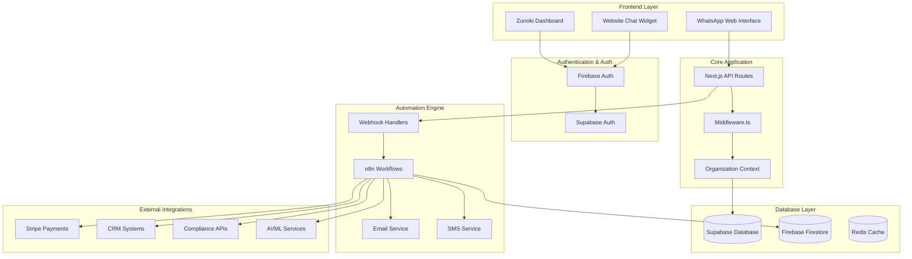
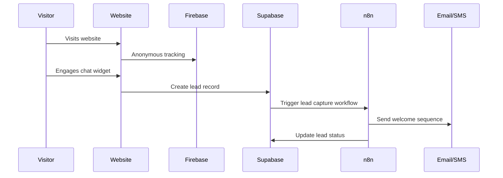
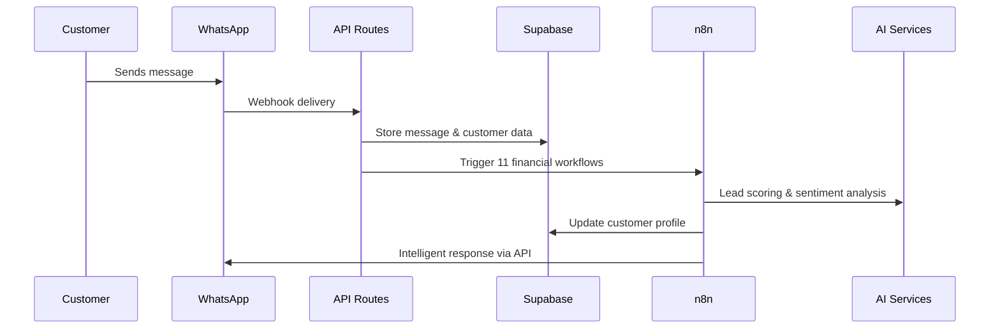
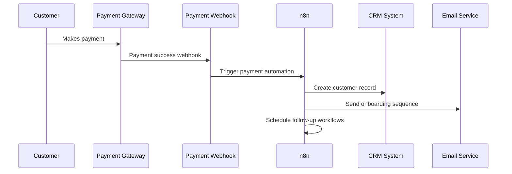

# 🔥 Firebase + n8n Integration Flow & Customer Journey

## 🏗️ System Architecture Overview



## 🔐 Firebase Integration Points

### 1. Authentication Flow
```typescript
// Firebase Auth → Supabase Integration
Firebase User Login → Firebase Auth Token → Supabase RLS → Organization Context
```

### 2. Real-time Data Sync
```typescript
// lib/firebase-sync.ts (NEW)
import { auth } from '@/lib/firebase'
import { supabase } from '@/lib/supabase/client'

export const syncFirebaseUser = async (firebaseUser) => {
  // Sync Firebase user to Supabase
  const { data } = await supabase
    .from('user_profiles')
    .upsert({
      uid: firebaseUser.uid,
      email: firebaseUser.email,
      display_name: firebaseUser.displayName,
      firebase_metadata: firebaseUser.metadata,
      last_sign_in: new Date().toISOString()
    })
}
```

### 3. Organization Context Flow
```typescript
// Firebase User → Organization → n8n Workflows
User Authentication → Organization ID → Tenant Isolation → Workflow Triggers
```

## 🎯 Complete Customer Journey Flow

### Phase 1: Initial Contact & Lead Capture


### Phase 2: WhatsApp Engagement


### Phase 3: Payment & Onboarding


## 🚀 Detailed Integration Flows

### 1. **Website Chat → Firebase → n8n Flow**
```typescript
// Customer Journey: Website Visitor → Lead → Customer
Website Chat Widget → Firebase Anonymous Auth → Lead Capture → n8n Lead Scoring → Email Nurturing
```

**Implementation:**
```typescript
// components/chat-widget.tsx
import { auth } from '@/lib/firebase'
import { useEffect } from 'react'

export function ChatWidget() {
  useEffect(() => {
    // Track anonymous users
    auth.onAuthStateChanged(async (user) => {
      if (user) {
        // Trigger n8n lead scoring
        await fetch('/api/webhooks/lead-capture', {
          method: 'POST',
          body: JSON.stringify({
            firebase_uid: user.uid,
            source: 'website_chat',
            timestamp: new Date().toISOString()
          })
        })
      }
    })
  }, [])
}
```

### 2. **WhatsApp → Organization Context → n8n Workflows**
```typescript
// Customer Journey: WhatsApp Message → Multi-tenant Processing → Comprehensive Automation
WhatsApp Message → Organization Identification → Customer Profile Building → 11 n8n Workflows
```

**Implementation Flow:**
1. **Message Received** (`lib/whatsapp-service.ts:1079`)
2. **Organization Context** → `getOrganizationId(customer.userId)`
3. **Customer Profile** → `buildFinancialCustomerProfile(customer.id)`
4. **Workflow Triggers** → 11 simultaneous n8n workflows:
   - Lead Scoring
   - Omnichannel Orchestration
   - Support Escalation
   - Business Intelligence
   - Dynamic Pricing
   - KYC/AML Compliance
   - Customer Success
   - Campaign Attribution
   - Enterprise Integration
   - Insurance Workflows
   - Investment Management

### 3. **Payment Success → Complete Onboarding Flow**
```typescript
// Customer Journey: Payment → Instant Onboarding → Customer Success
Payment Success → Customer Creation → Onboarding Automation → Success Monitoring
```

**Implementation:** (`app/api/webhooks/payment-success/route.ts`)
```typescript
export async function POST(request: NextRequest) {
  const payload = await request.json()

  // Trigger comprehensive payment automation
  await paymentAutomationService.handlePaymentSuccess({
    payment_id: payload.id,
    customer_email: payload.customer.email,
    amount: payload.amount,
    product_type: payload.metadata.product_type,
    organization_id: payload.metadata.organization_id
  })
}
```

## 🔄 Firebase-Specific Integration Points

### 1. **User Sync & Organization Mapping**
```typescript
// Firebase Auth → Supabase → Organization Context
Firebase User → user_profiles table → organization_id → Tenant Isolation
```

### 2. **Real-time Analytics Integration**
```typescript
// Firebase Analytics → n8n Business Intelligence
Firebase Events → Custom Analytics → n8n BI Workflows → Business Insights
```

### 3. **Multi-tenant Security**
```typescript
// Firebase Auth → RLS → Organization Isolation
Firebase Token → Supabase RLS → organization_id filtering → Secure Multi-tenancy
```

## 📊 Customer Journey Stages & Automation

### Stage 1: **Awareness** (Anonymous → Lead)
- **Trigger:** Website visit, chat engagement
- **Firebase:** Anonymous authentication
- **n8n Workflows:**
  - Lead capture and scoring
  - Behavioral tracking
  - Initial nurturing emails

### Stage 2: **Consideration** (Lead → Prospect)
- **Trigger:** WhatsApp engagement, form submission
- **Firebase:** User registration
- **n8n Workflows:**
  - Advanced lead scoring
  - Personalized content delivery
  - Multi-channel orchestration

### Stage 3: **Decision** (Prospect → Customer)
- **Trigger:** Payment intent, quote request
- **Firebase:** Customer profile completion
- **n8n Workflows:**
  - Dynamic pricing
  - Quote generation
  - Sales acceleration

### Stage 4: **Purchase** (Customer Creation)
- **Trigger:** Payment success
- **Firebase:** Customer authentication
- **n8n Workflows:**
  - Complete onboarding automation
  - Document collection
  - Account setup

### Stage 5: **Onboarding** (Customer → Active User)
- **Trigger:** First 30 days post-purchase
- **Firebase:** Usage tracking
- **n8n Workflows:**
  - Step-by-step guidance
  - Feature adoption tracking
  - Success milestone celebration

### Stage 6: **Growth** (Active User → Advocate)
- **Trigger:** Product usage, engagement metrics
- **Firebase:** Advanced analytics
- **n8n Workflows:**
  - Upsell opportunities
  - Referral programs
  - Loyalty rewards

### Stage 7: **Retention** (Ongoing Success)
- **Trigger:** Renewal periods, usage patterns
- **Firebase:** Predictive analytics
- **n8n Workflows:**
  - Churn prevention
  - Success optimization
  - Continuous value delivery

## 🎛️ Configuration & Setup

### Firebase Configuration
```typescript
// .env.local additions for Firebase integration
NEXT_PUBLIC_FIREBASE_API_KEY=your_firebase_api_key
NEXT_PUBLIC_FIREBASE_AUTH_DOMAIN=your_project.firebaseapp.com
NEXT_PUBLIC_FIREBASE_PROJECT_ID=your_project_id

# n8n Integration URLs
N8N_FIREBASE_SYNC_WEBHOOK=https://your-n8n.com/webhook/firebase-sync
N8N_ANALYTICS_WEBHOOK=https://your-n8n.com/webhook/analytics
```

### Multi-tenant Setup
```typescript
// middleware.ts enhancement for Firebase integration
import { auth } from '@/lib/firebase'

export async function middleware(request: NextRequest) {
  const firebaseUser = await auth.currentUser
  if (firebaseUser) {
    // Get organization context from Supabase
    const orgId = await getOrganizationId(firebaseUser.uid)
    request.headers.set('x-organization-id', orgId)
  }
}
```

## 🚨 Key Success Metrics & Monitoring

### Customer Journey KPIs
- **Lead Conversion Rate:** Website → WhatsApp engagement
- **Purchase Conversion:** Lead → Paying customer
- **Onboarding Completion:** Time to first value
- **Customer Lifetime Value:** Revenue per customer
- **Retention Rate:** Monthly/Annual retention
- **Support Efficiency:** Automated vs manual resolution

### Firebase Analytics Integration
- **Custom Events:** Journey stage transitions
- **User Properties:** Organization, customer tier, lifecycle stage
- **Conversion Funnels:** End-to-end customer journey
- **Cohort Analysis:** Customer success patterns

This comprehensive integration creates a seamless flow from initial website contact through complete customer success, with Firebase handling authentication and analytics while n8n manages the complex automation workflows that drive customer success in the fintech/insurance space.