# 🔄 n8n Workflow Diagrams & Visual Implementation Guide

## 🎯 **Complete System Architecture**

```mermaid
graph TB
    subgraph "Customer Touchpoints"
        WEB[🌐 Website Chat]
        WA[📱 WhatsApp]
        EMAIL[📧 Email]
        SMS[📱 SMS]
        PHONE[📞 Phone]
    end

    subgraph "Authentication Layer"
        FB[🔥 Firebase Auth]
        SUPA[🔐 Supabase Auth]
        ORG[🏢 Organization Context]
    end

    subgraph "API Gateway"
        API[⚡ Next.js API Routes]
        MW[🛡️ Middleware]
        HOOKS[🪝 Webhook Handlers]
    end

    subgraph "Database Layer"
        SBDB[(📊 Supabase DB)]
        CACHE[(⚡ Redis Cache)]
        FILES[(📁 File Storage)]
    end

    subgraph "n8n Automation Engine"
        CORE[🎯 Core Workflows]
        FINANCIAL[💰 Financial Workflows]
        INSURANCE[🛡️ Insurance Workflows]
        COMPLIANCE[📋 Compliance Workflows]
        SUCCESS[🎉 Customer Success]
    end

    subgraph "External Services"
        STRIPE[💳 Stripe]
        SENDGRID[📧 SendGrid]
        TWILIO[📱 Twilio]
        CRM[📈 CRM Systems]
        AI[🤖 AI Services]
    end

    subgraph "Analytics & Monitoring"
        ANALYTICS[📊 Firebase Analytics]
        METRICS[📈 Business Metrics]
        ALERTS[🚨 Alert System]
    end

    WEB --> FB
    WA --> API
    EMAIL --> HOOKS
    FB --> SUPA
    SUPA --> ORG
    API --> MW
    MW --> HOOKS
    HOOKS --> CORE
    CORE --> FINANCIAL
    CORE --> INSURANCE
    CORE --> COMPLIANCE
    CORE --> SUCCESS
    FINANCIAL --> STRIPE
    SUCCESS --> SENDGRID
    SUCCESS --> TWILIO
    CORE --> CRM
    CORE --> AI
    HOOKS --> SBDB
    SBDB --> CACHE
    CORE --> ANALYTICS
    ANALYTICS --> METRICS
    METRICS --> ALERTS
```

## 🚀 **Primary Workflow Triggers**

### **1. Website Lead Capture Flow**

### **2. WhatsApp Message Processing Flow**
```mermaid
flowchart TD
    A[📱 WhatsApp Message] --> B{🔍 Message Analysis}
    B --> C[🏢 Get Organization Context]
    C --> D[👤 Build Customer Profile]
    D --> E[🎯 Trigger 11 Workflows]

    E --> F1[📊 Lead Scoring]
    E --> F2[🌐 Omnichannel Orchestration]
    E --> F3[🆘 Support Escalation]
    E --> F4[📈 Business Intelligence]
    E --> F5[💰 Dynamic Pricing]
    E --> F6[📋 KYC/AML Compliance]
    E --> F7[🎉 Customer Success]
    E --> F8[📊 Campaign Attribution]
    E --> F9[🔗 Enterprise Integration]
    E --> F10[🛡️ Insurance Workflows]
    E --> F11[💹 Investment Management]

    F1 --> G[📊 Update Lead Score]
    F2 --> H[📧 Send Cross-channel Messages]
    F3 --> I[🚨 Route to Human Agent]
    F4 --> J[📈 Update Dashboards]
    F5 --> K[💵 Generate Personalized Quote]
    F6 --> L[📋 Compliance Check]
    F7 --> M[🎯 Success Milestone Tracking]
    F8 --> N[📊 Attribution Analysis]
    F9 --> O[🔄 CRM Sync]
    F10 --> P[🛡️ Insurance Processing]
    F11 --> Q[💹 Investment Recommendations]
```

### **3. Payment Success Automation Flow**
```mermaid
graph TD
    A[💳 Payment Successful] --> B[🪝 Webhook Triggered]
    B --> C[🔄 n8n Payment Automation]

    C --> D1[👤 Customer Account Creation]
    C --> D2[📧 Welcome Email Sequence]
    C --> D3[📋 Document Collection]
    C --> D4[📞 Onboarding Call Scheduling]
    C --> D5[🔓 Product Activation]
    C --> D6[📋 Compliance Setup]
    C --> D7[📊 Success Metrics Setup]
    C --> D8[🎁 Referral Program Enrollment]
    C --> D9[💹 Upsell Analysis]
    C --> D10[🎯 Customer Success Assignment]
    C --> D11[📊 Analytics Tracking]
    C --> D12[🔗 CRM Integration]

    D1 --> E[✅ Account Ready]
    D2 --> F[📧 5-Email Series Sent]
    D3 --> G[📋 KYC Documents Requested]
    D4 --> H[📅 Call Scheduled]
    D5 --> I[🚀 Product Access Granted]
    D12 --> J[📈 CRM Updated]
```

## 🎯 **Detailed Workflow Implementations**

### **Workflow 1: Advanced Lead Scoring**
```mermaid
flowchart LR
    A[📱 Customer Message] --> B[🔍 Message Analysis]
    B --> C[😊 Sentiment Analysis]
    B --> D[🎯 Intent Detection]
    B --> E[⚡ Urgency Assessment]

    C --> F[📊 Sentiment Score 1-10]
    D --> G[🏷️ Intent Category]
    E --> H[🚨 Urgency Level 1-10]

    F --> I[🧮 Lead Score Calculation]
    G --> I
    H --> I

    I --> J{📊 Score Threshold}
    J -->|Score > 80| K[🔥 Hot Lead Alert]
    J -->|Score 60-80| L[🌡️ Warm Lead Follow-up]
    J -->|Score < 60| M[❄️ Cold Lead Nurturing]

    K --> N[📧 Immediate Sales Notification]
    L --> O[📅 Schedule Follow-up]
    M --> P[📧 Educational Content Series]
```

### **Workflow 2: Omnichannel Orchestration**
```mermaid
graph TD
    A[🎯 Customer Interaction] --> B[📊 Interaction Analysis]
    B --> C[📱 Current Channel]
    B --> D[📈 Channel History]
    B --> E[⏰ Timing Preferences]
    B --> F[🌍 Language Detection]

    C --> G{🔀 Channel Coordination}
    D --> G
    E --> G
    F --> G

    G --> H[📧 Email Follow-up]
    G --> I[📱 SMS Reminder]
    G --> J[🔔 Push Notification]
    G --> K[📞 Call Scheduling]

    H --> L[✅ Email Sent]
    I --> M[✅ SMS Delivered]
    J --> N[✅ Notification Pushed]
    K --> O[📅 Call Scheduled]
```

### **Workflow 3: Support Escalation**
```mermaid
flowchart TD
    A[🆘 Support Request] --> B[🔍 Issue Analysis]
    B --> C[👤 Customer Tier Check]
    B --> D[📊 Issue Complexity]
    B --> E[💰 Financial Impact]
    B --> F[📋 Regulatory Sensitivity]

    C --> G{🎯 Escalation Decision}
    D --> G
    E --> G
    F --> G

    G -->|Enterprise Customer| H[🚨 Immediate Escalation]
    G -->|Complex Issue| I[🔧 Technical Specialist]
    G -->|High Financial Impact| J[💰 Manager Review]
    G -->|Regulatory Issue| K[📋 Compliance Team]
    G -->|Standard Request| L[🤖 AI Resolution]

    H --> M[📞 VIP Support Line]
    I --> N[🔧 Technical Team Assignment]
    J --> O[💼 Management Notification]
    K --> P[📋 Compliance Review]
    L --> Q[🤖 Automated Response]
```

### **Workflow 4: Dynamic Pricing**
```mermaid
graph LR
    A[💰 Pricing Inquiry] --> B[👤 Customer Profile Analysis]
    B --> C[📊 Risk Assessment]
    B --> D[📈 Market Conditions]
    B --> E[🏆 Competitive Analysis]

    C --> F[🧮 Price Calculation Engine]
    D --> F
    E --> F

    F --> G[💵 Base Price]
    F --> H[📉 Risk Adjustment]
    F --> I[🎯 Personalized Discount]

    G --> J[💰 Final Quote Generation]
    H --> J
    I --> J

    J --> K[📧 Quote Email]
    J --> L[📱 WhatsApp Quote]
    J --> M[📊 Pricing Analytics]
```

### **Workflow 5: KYC/AML Compliance**

### **Workflow 6: Customer Success Monitoring**
```mermaid
flowchart TD
    A[🎯 Customer Activity] --> B[📊 Usage Analytics]
    B --> C[📈 Engagement Score]
    B --> D[🎯 Feature Adoption]
    B --> E[💰 Value Realization]

    C --> F{🎯 Success Threshold}
    D --> F
    E --> F

    F -->|High Success| G[🎉 Success Celebration]
    F -->|Medium Success| H[🚀 Growth Opportunities]
    F -->|Low Success| I[🆘 Intervention Required]

    G --> J[🎁 Reward Program]
    G --> K[📣 Success Story]
    G --> L[🔄 Referral Invitation]

    H --> M[📚 Educational Content]
    H --> N[💹 Upsell Opportunities]

    I --> O[📞 Proactive Outreach]
    I --> P[🛠️ Additional Support]
    I --> Q[🎯 Custom Success Plan]
```

## 🔄 **Workflow Integration Points**

### **n8n ↔ Firebase Integration**
```mermaid
graph LR
    A[🔥 Firebase Event] --> B[🪝 Webhook Trigger]
    B --> C[🔄 n8n Workflow]
    C --> D[📊 Process Data]
    D --> E[🔄 Update Firebase]
    E --> F[📱 Real-time Updates]
```

### **n8n ↔ Supabase Data Flow**
```mermaid
graph TD
    A[📊 Supabase Data] --> B[🔄 n8n Query]
    B --> C[🧮 Data Processing]
    C --> D[📈 Analytics]
    D --> E[📊 Dashboard Updates]
    E --> F[🔄 Supabase Write]
```

### **Multi-tenant Workflow Isolation**
```mermaid
flowchart LR
    A[🏢 Organization A] --> B[🔄 n8n Workflow A]
    C[🏢 Organization B] --> D[🔄 n8n Workflow B]
    E[🏢 Organization C] --> F[🔄 n8n Workflow C]

    B --> G[📊 Isolated Data A]
    D --> H[📊 Isolated Data B]
    F --> I[📊 Isolated Data C]
```

## 📊 **Workflow Monitoring & Analytics**

### **Real-time Workflow Dashboard**
```mermaid
graph TD
    A[🔄 n8n Workflows] --> B[📊 Execution Metrics]
    B --> C[⚡ Success Rate]
    B --> D[⏱️ Execution Time]
    B --> E[🚨 Error Rate]
    B --> F[📈 Throughput]

    C --> G[📊 Dashboard]
    D --> G
    E --> G
    F --> G

    G --> H[🚨 Alert System]
    H --> I[📧 Email Alerts]
    H --> J[📱 SMS Alerts]
    H --> K[🔔 Push Notifications]
```

### **Business Impact Tracking**
```mermaid
flowchart LR
    A[🔄 Workflow Execution] --> B[📊 Business Metrics]
    B --> C[💰 Revenue Impact]
    B --> D[😊 Customer Satisfaction]
    B --> E[⏱️ Time Savings]
    B --> F[📈 Conversion Rates]

    C --> G[📊 ROI Dashboard]
    D --> G
    E --> G
    F --> G
```

## 🚀 **Implementation Checklist**

### **Phase 1: Core Setup** ✅
- [x] n8n instance deployment
- [x] Webhook service implementation
- [x] Firebase integration
- [x] Supabase connection
- [x] Basic workflow templates

### **Phase 2: Advanced Workflows** ✅
- [x] Lead scoring implementation
- [x] Omnichannel orchestration
- [x] Payment automation
- [x] Customer success tracking
- [x] Compliance monitoring

### **Phase 3: Optimization** 📋
- [ ] Performance monitoring
- [ ] A/B testing workflows
- [ ] Advanced analytics
- [ ] Machine learning integration
- [ ] Predictive analytics

### **Phase 4: Scale** 🚀
- [ ] Multi-region deployment
- [ ] Advanced security features
- [ ] Enterprise integrations
- [ ] Custom workflow builder
- [ ] API rate limiting

This comprehensive workflow system ensures seamless automation across the entire customer journey, maximizing efficiency and customer success while maintaining enterprise-grade reliability and compliance.